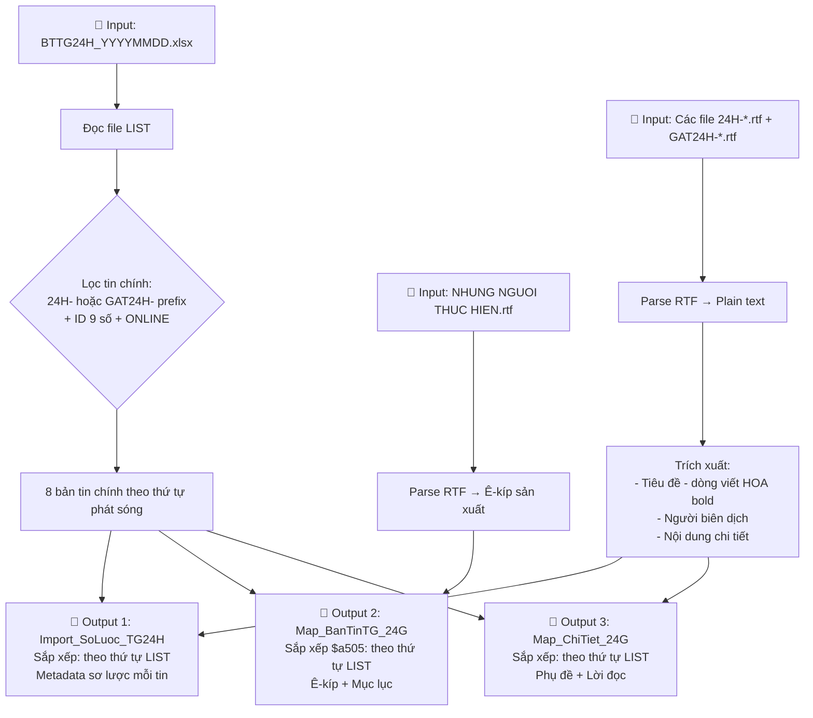

# Đặc Tả Kỹ Thuật: Tự Động Hóa Biên Mục Tin Tức Thế Giới 24H

> **Mục đích:** Chuyển đổi dữ liệu phi cấu trúc (file kịch bản `.rtf` + danh sách phát sóng `.xlsx`) thành dữ liệu có cấu trúc (3 file Excel output) phục vụ công tác biên mục tư liệu truyền hình.

---

## 📋 Đánh Giá Tìm Hiểu Ban Đầu


## 1. Dữ Liệu Đầu Vào (Input)

### 1.1. File LIST — `BTTG24H_{YYYYMMDD}.xlsx`

Đây là file danh sách cấu trúc chương trình Thế Giới 24H của ngày phát sóng.

**Quy ước tên file:**
- `BTTG24H` = Bản tin Thế Giới 24H
- `YYYYMMDD` = năm-tháng-ngày (ví dụ: `20260609` = ngày 09/06/2026)

**Cấu trúc file: 1 sheet duy nhất (Sheet1)**

#### Cấu trúc cột

| Cột | Nội dung | Ví dụ |
|-----|----------|-------|
| A | Tên file / tên mục | `24H-Iran/Israel-Attacks/Halt` |
| B | Ghi chú trạng thái biên tập | `old-ok`, `Tiok`, `Ngan ok`, `H vid ok`, `R`, `okvb` |
| C | Video ID (9 chữ số) hoặc mã hình hiệu | `260609195`, `hh24h2025` |
| D | Trạng thái | `ONLINE` hoặc `None` |
| E | Thời lượng 1 (dạng `time`) | `02:08:00` |
| F | Thời lượng 2 (dạng `time`) | `01:08:00` |
| **G** | **Thời lượng 3 (dạng `time`) — CỘT DÙNG ĐỂ TÍNH $a306** | `01:08:00` |
| H | (để trống) | `None` |
| I | User biên tập | `thong_mc` |
| J | Timestamp | `2026-09-06 15:06:24` |
| K–L | User metadata | `ngan_hk` |
| M | (để trống) | `None` |

> [!NOTE]
> **Các dòng đầu file LIST** có cấu trúc đặc biệt, liệt kê thông tin ê-kíp sản xuất trước khi đến nội dung phát sóng:
>
> | Dòng | Cột A | Ý nghĩa |
> |------|-------|---------|
> | 1 | `THẾ GIỚI 24H 09-06-2026` | Tiêu đề bản tin (chứa ngày phát sóng) |
> | 2 | `BGĐ MÃ CHÍ THÔNG` | Ban Giám đốc (Chịu trách nhiệm nội dung) |
> | 3 | `BT KIM NGÂN, THẢO TRANG` | Biên tập |
> | 4 | `BD MINH ĐỨC, NHƯ ANH` | Biên dịch |
> | 5 | `MC VIỆT HÙNG` | MC (Hiện dẫn) |
> | 6 | `ĐD VIẾT HIẾU` | Đạo diễn |
> | 7 | `KT XUÂN ĐẠI, MINH TẤN` | Kỹ thuật |
>
> Từ dòng 8 trở đi mới là các mục phát sóng (HINH HIEU, CHAO DAU, HIEN, tin chính, GAT, CHAO CUOI, ENDING...).

> [!IMPORTANT]
> **Cột E/F/G** lưu trữ dưới dạng **`datetime.time`** (format `hh:mm:ss` khi đọc bằng openpyxl).
> Thứ tự các dòng nội dung trong file LIST (từ dòng 8 trở đi) chính là **thứ tự phát sóng** — đây là thứ tự chuẩn được dùng cho cả 3 file output.

### 1.2. Các file `.rtf` — Kịch bản tin

Mỗi file `.rtf` có tên trùng hoặc gần trùng với giá trị cột A của file LIST. Ví dụ:
- `24H-IranIsrael-AttacksHalt.rtf` ← tương ứng `24H-Iran/Israel-Attacks/Halt` (ký tự `/` bị thay thế trong tên file)
- `GAT24H-Israel airstrike Tyre.rtf` ← tương ứng `GAT24H-Israel airstrike Tyre`

> [!WARNING]
> **Tên file RTF và tên mục trong LIST có thể khác nhau** do ký tự đặc biệt (`/`) bị thay thế khi lưu file. App cần xử lý mapping linh hoạt (ví dụ: loại bỏ `/` khi so sánh, hoặc dùng fuzzy matching).

**Cấu trúc nội dung (sau khi parse RTF thành plain text) — Tin chính tiền tố `24H-`:**

```
Dòng 1: Tên tin tiếng Anh (nguồn gốc)                   ← BỎ QUA
Dòng 2: Tiêu đề nguồn tiếng Anh (headline)               ← BỎ QUA
Dòng 3: Mã hình/video                                     ← BỎ QUA
Dòng 4: Mã hình/video thêm (nếu có)                       ← BỎ QUA
Dòng N: Ngày (nếu có, ví dụ "Ngày 9/6/2026")             ← BỎ QUA
Dòng N+1: Tên người biên dịch                             ← $a500 (Map3)
Dòng N+2: (trống)
Dòng N+3: TIÊU ĐỀ BẢN TIN (VIẾT HOA TOÀN BỘ, bold)     ← $a245
Dòng N+4: (trống)
Dòng N+5: PHỤ ĐỀ / SUBTITLE (VIẾT HOA, nếu có)          ← Dòng đầu tiên của $a520
Dòng N+6+: NỘI DUNG TIN (lời đọc voiceover)              ← $a520 (Map3)
```

**Cấu trúc nội dung — Tin GAT (tiền tố `GAT24H-`):**

```
Dòng 1: GẠT TG24H (nhãn gạt, bold, underline)           ← BỎ QUA
Dòng 2: (trống)
Dòng 3: Tiêu đề nguồn tiếng Anh (headline)               ← BỎ QUA
Dòng 4: Mã hình/video                                     ← BỎ QUA
Dòng 5: Tên người biên dịch                               ← $a500 (Map3)
Dòng 6: (trống)
Dòng 7: TIÊU ĐỀ BẢN TIN (VIẾT HOA TOÀN BỘ, bold)       ← $a245
Dòng 8: (trống)
Dòng 9: PHỤ ĐỀ / SUBTITLE (VIẾT HOA, nếu có)            ← Dòng đầu tiên của $a520
Dòng 10+: NỘI DUNG TIN (lời đọc voiceover)               ← $a520 (Map3)
```

> [!NOTE]
> **Phân loại file RTF theo tên trong LIST:**
> - Tiền tố `24H-` → bản tin chính (cần xử lý)
> - Tiền tố `GAT24H-` → tin gạt (cũng là tin chính, cần xử lý)
> - `CHAO DAU - HEADLINES`, `CHAO CUOI`, `ENDING`, `HINH HIEU`, `HIEN *`, `NHUNG NGUOI THUC HIEN`, tiêu đề bản tin, dòng ê-kíp → **BỎ QUA**

### 1.3. File `NHUNG NGUOI THUC HIEN.rtf` — Ê-kíp sản xuất

Chứa danh sách ê-kíp sản xuất chương trình theo format:

```
CHỊU TRÁCH NHIỆM NỘI DUNG: MÃ CHÍ THÔNG

BIÊN TẬP: KIM NGÂN - THẢO TRANG

BIÊN DỊCH:

HIỆN DẪN: VIỆT HÙNG

ĐẠO DIỄN:

KỸ THUẬT:

TRANG ĐIỂM: THIÊN KIM

Website: www.htv.com.vn/tin-tuc
Fanpage: www.fb.com/htvtintuc
Kênh Youtube: www.youtube.com/c/htvtintuc
```

> [!WARNING]
> Một số chức danh có thể **trống** (ví dụ: "BIÊN DỊCH:", "ĐẠO DIỄN:", "KỸ THUẬT:" không có tên). App cần xử lý trường hợp này — giữ nguyên dòng chức danh kèm dấu `:` phía sau (không bỏ qua).

> [!NOTE]
> File `ENDING.rtf` trong TG24H thường **rỗng** (chỉ có RTF markup, không có nội dung). Thông tin ê-kíp được lấy từ `NHUNG NGUOI THUC HIEN.rtf`.

### 1.4. Các file `.rtf` phụ trợ khác

Ngoài tin chính và file ê-kíp, thư mục input còn chứa các file RTF phụ:

| File | Nội dung | Xử lý |
|------|----------|-------|
| `THẾ GIỚI 24H DD-MM-YYYY.rtf` | Tiêu đề bản tin | BỎ QUA (rỗng) |
| `BGĐ MÃ CHÍ THÔNG.rtf` | Tên BGĐ | BỎ QUA (rỗng) |
| `BT KIM NGÂN, THẢO TRANG.rtf` | Tên biên tập | BỎ QUA (rỗng) |
| `BD MINH ĐỨC, NHƯ ANH.rtf` | Tên biên dịch | BỎ QUA (rỗng) |
| `MC VIỆT HÙNG.rtf` | Tên MC | BỎ QUA (rỗng) |
| `ĐD VIẾT HIẾU.rtf` | Tên đạo diễn | BỎ QUA (rỗng) |
| `KT XUÂN ĐẠI, MINH TẤN.rtf` | Tên kỹ thuật | BỎ QUA (rỗng) |
| `HINH HIEU.rtf` | Hình hiệu | BỎ QUA (rỗng) |
| `HIEN 1.rtf` ... `HIEN 6.rtf` | Lời dẫn hiện dẫn MC | BỎ QUA |
| `CHAO DAU - HEADLINES.rtf` | Lời chào + headlines | BỎ QUA |
| `CHAO CUOI.rtf` | Lời chào kết thúc | BỎ QUA |
| `ENDING.rtf` | Ending (rỗng) | BỎ QUA |
| `TMP.rtf` | File tạm | BỎ QUA |

> [!NOTE]
> Các file RTF ê-kíp ở trên (BGĐ, BT, BD, MC, ĐD, KT) đều **rỗng** — chỉ có tên file chứa thông tin. Thông tin ê-kíp thực sự nằm trong `NHUNG NGUOI THUC HIEN.rtf` hoặc có thể trích từ tên file ở các dòng đầu của LIST.

---

## 2. Quy Tắc Lọc Tin Chính

Từ file LIST (từ dòng 8 trở đi, sau phần ê-kíp), lọc ra các bản tin chính thỏa mãn **TẤT CẢ** điều kiện sau:

1. **Tên file (cột A)** có tiền tố `24H-` hoặc `GAT24H-`
2. **Video ID (cột C)** là số nguyên 9 chữ số
3. **Trạng thái (cột D)** = `ONLINE`

**Các mục bị loại bỏ:**
- Dòng 1–7: Tiêu đề bản tin + ê-kíp sản xuất
- `HINH HIEU` (hình hiệu, mã `hh24h2025`)
- `CHAO DAU - HEADLINES` (lời chào + headlines)
- `HIEN 1` ... `HIEN 6` (lời dẫn hiện dẫn giữa các tin)
- `CHAO CUOI` (lời chào kết thúc)
- `ENDING` (ending, mã `end24h2025`)
- `NHUNG NGUOI THUC HIEN` (danh sách ê-kíp)

> [!IMPORTANT]
> Bản tin TG24H có **hai tiền tố**: `24H-` (tin chính) và `GAT24H-` (tin gạt/chuyển chuyên đề). Cả hai đều là tin chính cần xử lý. Các mục `HIEN 1`–`HIEN 6` là lời dẫn hiện dẫn xen giữa các tin, cần loại bỏ.

**Kết quả mẫu (ngày 09/06/2026):** 8 bản tin chính.

---

## 3. Quy Tắc Chuyển Đổi Thời Lượng

### Dữ liệu nguồn
- **Cột F** của file LIST: giá trị `datetime.time` (format `hh:mm:ss`)

### Cách đọc

Khi đọc bằng openpyxl, cột F trả về đối tượng `datetime.time`. Chuyển đổi sang format `00:mm:ss`:

```python
import datetime

time_value = cell.value  # datetime.time object, e.g. time(0, 35, 0)
if isinstance(time_value, datetime.time):
    total_seconds = time_value.hour * 3600 + time_value.minute * 60 + time_value.second
    minutes = total_seconds // 60
    seconds = total_seconds % 60
    result = f"00:{minutes:02d}:{seconds:02d}"
```


> [!IMPORTANT]
> **Cột dùng để tính thời lượng:** Đối chiếu với output mẫu, cần sử dụng **cột F** (Thời lượng 2) thay vì cột G. Ví dụ xác minh:
>
> | Tên file | Cột F | Cột G | Output $a306 | Cột khớp |
> |----------|-------|-------|--------------|----------|
> | `24H-Iran/Israel-Attacks/Halt` | `01:08:00` | `01:08:00` | `00:01:08` | F=G |
> | `GAT24H-Israel airstrike Tyre` | `00:35:00` | `00:37:00` | `00:00:35` | **F** ✅ |
> | `24H-LIVE-UKRAINE-CRISIS/...` | `00:33:00` | `00:24:00` | `00:00:33` | **F** ✅ |
> | `GAT24H-...NEWZEALAND-WEATHER/` | `00:46:00` | `00:47:00` | `00:00:46` | **F** ✅ |
>
> → **Dùng cột F** cho tính thời lượng output.

**Ví dụ xác minh đầy đủ:**

| ID | Cột F (time) | Output `$a306` |
|----|-------------|----------------|
| 260609195 | `01:08:00` | `00:01:08` ✅ |
| 260609196 | `00:35:00` | `00:00:35` ✅ |
| 260609197 | `00:33:00` | `00:00:33` ✅ |
| 260609198 | `00:47:00` | `00:00:47` ✅ |
| 260609199 | `01:07:00` | `00:01:07` ✅ |
| 260609200 | `00:56:00` | `00:00:56` ✅ |
| 260609201 | `00:55:00` | `00:00:55` ✅ |
| 260609202 | `00:46:00` | `00:00:46` ✅ |

---

## 4. Đặc Tả 3 File Output

### 4.1. File 1 — `Import_SoLuoc_TG24H_{YYYYMMDD}.xlsx`

**Mục đích:** Tổng hợp metadata sơ lược của tất cả tin chính trong ngày.

**Thứ tự sắp xếp:** Theo **thứ tự xuất hiện trong file LIST** (thứ tự phát sóng).

#### Cấu trúc cột

| Cột | Tên | Nguồn dữ liệu | Quy tắc | Ví dụ |
|-----|-----|----------------|---------|-------|
| A | `STT` | Tự sinh | Số thứ tự từ `01`, format 2 chữ số (`01`–`08`) | `01` |
| B | `$a090` | LIST cột C | Video ID (string) | `260609195` |
| C | `$a245` | File `.rtf` | Tiêu đề viết HOA, lấy từ dòng tiêu đề bold trong file RTF tương ứng | `THỦ TƯỚNG ISRAEL: XUNG ĐỘT VỚI IRAN ĐÃ CHẤM DỨT` |
| D | `$n245` | — | **Để trống** | |
| E | `$p245` | — | **Để trống** | |
| F | `$b245` | Ngày từ tên file LIST | Cố định pattern: `Tin thế giới - bản tin 24g ngày {DD}/{MM}/{YYYY}` | `Tin thế giới - bản tin 24g ngày 09/06/2026` |
| G | `$a246` | — | **Để trống** | |
| H | `$a260` | Cố định | `Tp.HCM` | `Tp.HCM` |
| I | `$b260` | Cố định | `Trung tâm tin tức HTV` | `Trung tâm tin tức HTV` |
| J | `$c260` | Tên file LIST | Năm (số nguyên) | `2026` |
| K | `$a300` | Cố định | `File MXF` | `File MXF` |
| L | `$c300` | — | **Để trống** | |
| M | `$a306` | LIST cột F | Thời lượng format `00:mm:ss` (xem mục 3) | `00:01:08` |
| N | `$a490` | — | **Để trống** | |
| O | `$a500` | LIST cột C + cột A | `Tên file: {ID}  {Tên file}` (2 dấu cách giữa ID và tên) | `Tên file: 260609195  24H-Iran/Israel-Attacks/Halt` |
| P | `$t773` | — | **Để trống** | |
| Q | `$r773` | — | **Để trống** | |
| R | `$r773` | — | **Để trống** (có 2 cột cùng tên) | |
| S | `$a911` | Cố định | `Trung tâm Phát hình - Tư liệu HTV` | `Trung tâm Phát hình - Tư liệu HTV` |

> [!NOTE]
> **Dòng 1** là header (tên cột). Dữ liệu bắt đầu từ **dòng 2**.


---

### 4.2. File 2 — `Map_BanTinTG_24G_{YYYYMMDD}.xlsx`

**Mục đích:** Liên kết ê-kíp sản xuất với danh sách nội dung phát sóng (mục lục) của ngày hôm đó.

**Thứ tự sắp xếp:** `$a505` sắp xếp theo **thứ tự xuất hiện trong file LIST** (thứ tự phát sóng), giống Import1.

#### Cấu trúc cột

| Cột | Tên | Nguồn | Quy tắc |
|-----|-----|-------|---------|
| A | `$a090` | Người dùng nhập | Mã hiệu chương trình, cố định cho tất cả dòng. Ví dụ: `K303419` |
| B | `$a500` | NHUNG NGUOI THUC HIEN.rtf | Ê-kíp sản xuất — xem chi tiết bên dưới |
| C | `$a505` | Tổng hợp | Mục lục phát sóng — xem chi tiết bên dưới |
| D | `$a911` | Cố định | Tên người biên mục, chỉ ở **dòng 2**, các dòng sau **để trống**. Ví dụ: `Phạm Thị Đông` |

#### Chi tiết cột `$a500` (Ê-kíp sản xuất)

Lấy từ file `NHUNG NGUOI THUC HIEN.rtf`, mỗi dòng chức danh điền vào một dòng trong cột `$a500`:

| Dòng | Giá trị `$a500` | Ghi chú |
|------|-----------------|---------|
| 2 | `CHỊU TRÁCH NHIỆM NỘI DUNG: {TÊN}` | Trích từ NHUNG NGUOI THUC HIEN.rtf |
| 3 | `BIÊN TẬP: {TÊN}` | Trích từ NHUNG NGUOI THUC HIEN.rtf |
| 4 | `BIÊN DỊCH: {TÊN}` | Có thể trống (chỉ có "BIÊN DỊCH:") |
| 5 | `HIỆN DẪN: {TÊN}` | Trích từ NHUNG NGUOI THUC HIEN.rtf |
| 6 | `ĐẠO DIỄN: {TÊN hoặc trống}` | Có thể trống |
| 7 | `KỸ THUẬT: {TÊN hoặc trống}` | Có thể trống |
| 8 | `TRANG ĐIỂM: {TÊN}` | Trích từ NHUNG NGUOI THUC HIEN.rtf |
| 9 | `Website: www.htv.com.vn/tin-tuc` | **Cố định** |
| 10 | `Fanpage: www.fb.com/htvtintuc` | **Cố định** |
| 11 | `Kênh Youtube: www.youtube.com/c/htvtintuc` | **Cố định** |

> [!NOTE]
> Tổng cộng 10 dòng ê-kíp (dòng 2–11). Nếu danh sách tin ($a505) có nhiều hơn 10 mục, các dòng `$a500` thừa sẽ để trống (`None`).


#### Chi tiết cột `$a505` (Mục lục phát sóng)

Mỗi dòng ứng với 1 bản tin chính, format:

```
{STT} - {TIÊU ĐỀ VIẾT HOA}. Thời lượng: {00:mm:ss}. ID: {Video_ID}
```

**Ví dụ:**
```
01 - THỦ TƯỚNG ISRAEL: XUNG ĐỘT VỚI IRAN ĐÃ CHẤM DỨT. Thời lượng: 00:01:08. ID: 260609195
```

> [!IMPORTANT]
> **STT trong Map2 bắt đầu từ `01`** và dùng thứ tự **xuất hiện trong file LIST** (giống Import1).
> - Tiêu đề lấy từ **dòng tiêu đề bold viết HOA** trong file RTF tương ứng.
> - Thời lượng lấy từ **cột F** của file LIST, chuyển sang format `00:mm:ss` (xem mục 3).
> - ID lấy từ **cột C** của file LIST.

---

### 4.3. File 3 — `Map_ChiTiet_24G_{YYYYMMDD}.xlsx`

**Mục đích:** Chứa toàn bộ nội dung chi tiết (lời đọc voiceover + phụ đề) của tất cả bản tin.

**Sheet name:** `24G`

**Thứ tự sắp xếp:** Theo **thứ tự xuất hiện trong file LIST** (thứ tự phát sóng), giống Import1 và Map2.

#### Cấu trúc cột

| Cột | Tên | Quy tắc |
|-----|-----|---------|
| A | `$a090` | Video ID — lặp lại cho tất cả dòng thuộc cùng bản tin |
| B | `$a500` | Người biên dịch — chỉ điền ở **dòng đầu tiên** của mỗi bản tin, các dòng sau = trống |
| C | `$a520` | Nội dung phụ đề hoặc lời đọc voiceover |

**Dòng 1** là header. Dữ liệu bắt đầu từ **dòng 2**.

#### Quy tắc xử lý nội dung RTF cho Map3

**Bước 1: Parse RTF thành plain text**

Chuyển đổi file RTF raw (có markup `\f0`, `\cf1`, `\par`, `\u7841?`...) thành văn bản thuần (plain text Unicode).

**Bước 2: Loại bỏ các dòng không cần thiết**

Bỏ qua các dòng sau:
- **Các dòng header** đầu file: tên tin tiếng Anh, headline nguồn, mã hình/video, ngày
- **Dòng nhãn gạt**: `GẠT TG24H` (ở đầu file GAT24H-*)
- **Dòng tiêu đề bản tin** (viết HOA, bold) — đã dùng cho `$a245` ở Import1
- **Dòng trống** (blank lines)
- **Dòng tên người biên dịch** — đã dùng cho `$a500`

**Bước 3: Trích xuất người biên dịch (`$a500`)**

Chỉ ở **dòng đầu tiên** của mỗi bản tin trong Map3:

- Tìm dòng chứa tên người biên dịch trong file RTF. Thường là dòng ngắn, chỉ chứa tên người (ví dụ: `Thảo Trang`, `Như Anh`, `Minh Đức`, `Việt Hà`).
- Format output: `Biên dịch: {Tên}` (ví dụ: `Biên dịch: Thảo Trang`)

**Ví dụ thực tế:**

| ID | $a500 (dòng đầu) |
|----|-------------------|
| 260609195 | `Biên dịch: Thảo Trang` |
| 260609196 | `Biên dịch: Như Anh` |
| 260609197 | `Biên dịch: Minh Đức ` |
| 260609198 | `Biên dịch: Như Anh` |
| 260609199 | `Biên dịch: Việt Hà ` |
| 260609200 | `Biên dịch: Thảo Trang` |
| 260609201 | (trống — không có người biên dịch rõ ràng) |
| 260609202 | `Biên dịch: Minh Đức ` |

> [!NOTE]
> Format: `Biên dịch: TÊN` — chỉ 1 người biên dịch. Một số tên có thể có trailing space (giữ nguyên theo output mẫu).

**Bước 4: Xử lý nội dung cho `$a520`**

Mỗi đoạn văn bản (paragraph) sau khi loại bỏ các dòng rác = 1 dòng trong `$a520`. Nội dung gồm:

1. **Phụ đề viết HOA**: Các dòng ngắn viết HOA toàn bộ, thường mô tả bối cảnh ngắn gọn
   - Ví dụ: `NHƯNG ĐỂ NGỎ KHẢ NĂNG ĐÁP TRẢ NẾU TIẾP TỤC BỊ TẤN CÔNG`
   - Ví dụ: `TỔNG THỐNG MỸ: "THỎA THUẬN VỚI IRAN ĐANG Ở GIAI ĐOẠN CUỐI CÙNG"`

2. **Lời đọc voiceover**: Các đoạn văn thường viết hoa đầu câu
   - Ví dụ: `Trong tuyên bố được phát sóng trên truyền hình, ông Netanyahu nói...`

> [!NOTE]
> Nội dung chỉ gồm phụ đề viết HOA xen kẽ với lời đọc voiceover, không có phát biểu trích dẫn dạng `CUT xx:` hay `{ nội dung }`.

---

## 5. Tổng Quan Luồng Xử Lý



---

## 6. Quy Ước Đặt Tên File Output

| File | Pattern tên | Ví dụ |
|------|-------------|-------|
| Import1 | `Import_SoLuoc_TG24H_{YYYYMMDD}.xlsx` | `Import_SoLuoc_TG24H_20260609.xlsx` |
| Map2 | `Map_BanTinTG_24G_{YYYYMMDD}.xlsx` | `Map_BanTinTG_24G_20260609.xlsx` |
| Map3 | `Map_ChiTiet_24G_{YYYYMMDD}.xlsx` | `Map_ChiTiet_24G_20260609.xlsx` |

> [!NOTE]
> Tên file dùng **ngày đầy đủ YYYYMMDD**. Map3 có sheet name `24G`.

---

## 7. Bảng Tham Chiếu Nhanh: Thứ Tự Sắp Xếp

| File Output | Thứ tự sắp xếp | Nguồn thứ tự |
|-------------|-----------------|--------------|
| **Import1** (SoLuoc) | Theo thứ tự xuất hiện trong danh sách phát sóng | File LIST (thứ tự phát sóng) |
| **Map2** (BanTin) – cột `$a505` | Theo thứ tự xuất hiện trong danh sách phát sóng | File LIST (thứ tự phát sóng) |
| **Map3** (ChiTiet) | Theo thứ tự xuất hiện trong danh sách phát sóng | File LIST (thứ tự phát sóng) |

---

## 8. Xử Lý RTF: Chi Tiết Kỹ Thuật

### 8.1. Cấu trúc RTF

File RTF sử dụng encoding ANSI (cp1252) với Unicode escapes cho ký tự tiếng Việt:
- `\u7841?` → ký tự Unicode U+1EA1 (ạ)
- `\\'e0` → ký tự Latin-1 0xE0 (à)
- `\par` → ngắt đoạn (paragraph break)
- `\tab` → tab (thường đánh dấu đầu đoạn nội dung)
- `\cf1` → màu xanh lá (nội dung chính)
- `\cf2` → màu đen (kết thúc đoạn)
- `\b` → bold, `\b0` → tắt bold
- `\ul` → underline, `\ulnone` → tắt underline

### 8.2. Mã màu trong RTF

| Mã | Màu | Ý nghĩa |
|----|------|---------|
| `\cf1` | Xanh lá (`rgb(0,128,0)`) | Tiêu đề, tên tin tiếng Anh, nhãn gạt, mã hình, tên biên dịch, phụ đề viết HOA |
| `\cf2` | Đen (`rgb(0,0,0)`) | Kết thúc đoạn, lời đọc voiceover |
| `\cf3` | Xanh navy (`rgb(0,0,128)`) | Link website/fanpage/youtube (chỉ trong NHUNG NGUOI THUC HIEN.rtf) |

> [!NOTE]
> Lời đọc voiceover xuất hiện ở text đen (`\cf2` hoặc không có mã màu). `\cf3` xanh navy chỉ dùng cho link trong `NHUNG NGUOI THUC HIEN.rtf`.

### 8.3. Đặc trưng RTF của tin GAT24H

File kịch bản `GAT24H-*.rtf` có dòng đầu tiên là nhãn gạt:
```
GẠT TG24H
```
(viết hoa, bold, underline). Dòng này cần bỏ qua khi parse.

### 8.4. Thư viện đề xuất cho parse RTF

- **Python:** `striprtf` hoặc custom parser xử lý Unicode escapes
- Lưu ý: Nhiều RTF parser tiêu chuẩn không xử lý tốt Unicode tiếng Việt dạng `\u{code}?`. Cần kiểm tra kỹ output.

---

## 9. Giá Trị Cố Định (Constants)

```python
CONSTANTS = {
    "$a260": "Tp.HCM",
    "$b260": "Trung tâm tin tức HTV",
    "$a300": "File MXF",
    "$a911_import1": "Trung tâm Phát hình - Tư liệu HTV",
    "$a911_map2": "Phạm Thị Đông",  # chỉ ở dòng 2, có thể thay đổi
    "$a090_map2": "K303419",  # mã hiệu chương trình, có thể thay đổi
    "website": "www.htv.com.vn/tin-tuc",
    "fanpage": "www.fb.com/htvtintuc",
    "youtube": "www.youtube.com/c/htvtintuc",
    "$b245_pattern": "Tin thế giới - bản tin 24g ngày {DD}/{MM}/{YYYY}",
    "$a500_import1_pattern": "Tên file: {ID}  {Tên file}",  # 2 dấu cách
    "$a500_map3_pattern": "Biên dịch: {Tên}",
}
```


---

## 10. Các Edge Cases Cần Xử Lý

| Case | Mô tả | Cách xử lý |
|------|--------|-------------|
| Chức danh trống | `BIÊN DỊCH:`, `ĐẠO DIỄN:`, `KỸ THUẬT:` không có tên | Giữ nguyên dòng kèm dấu `:` phía sau |
| Ký tự `/` trong tên file | Tên trong LIST là `24H-Iran/Israel-Attacks/Halt` nhưng file RTF thay `/` | So sánh tên file linh hoạt, loại bỏ `/` khi matching |
| Trailing `/` trong tên file | `GAT24H-090626 NEWZEALAND-WEATHER/` có `/` cuối | Trim ký tự `/` cuối khi so sánh |
| Trailing space trong tên biên dịch | `Minh Đức `, `Việt Hà ` có space cuối | Giữ nguyên theo output mẫu |
| File ENDING rỗng | `ENDING.rtf` không có nội dung | Dùng `NHUNG NGUOI THUC HIEN.rtf` thay thế |
| Cột F và G khác nhau | Thời lượng cột F ≠ cột G | Dùng **cột F** cho output |
| Tin GAT24H | Tiền tố `GAT24H-` thay vì `24H-` | Cả hai đều là tin chính, xử lý như nhau |
| Dòng ê-kíp đầu LIST | Dòng 1-7 chứa thông tin ê-kíp | Bỏ qua khi lọc tin chính |
| HIEN 1–6 | Lời dẫn hiện dẫn xen giữa các tin | Bỏ qua (không phải tin chính) |
| Không có CUT/Soundbite | TG24H không dùng format CUT | Không cần xử lý gộp CUT |
| Tin không có biên dịch | Một số tin không ghi rõ người biên dịch | `$a500` Map3 để trống |

---

---

## 11. Checklist Cho App Tự Động

- [ ] Parse tên file LIST → trích xuất ngày phát sóng (YYYYMMDD)
- [ ] Đọc file LIST (sheet duy nhất)
- [ ] Nhận diện các dòng ê-kíp đầu file (dòng 1–7)
- [ ] Lọc tin chính từ LIST (prefix `24H-` hoặc `GAT24H-`, ID 9 số, ONLINE)
- [ ] Loại bỏ HIEN, CHAO DAU, CHAO CUOI, ENDING, HINH HIEU, NHUNG NGUOI THUC HIEN
- [ ] Parse NHUNG NGUOI THUC HIEN.rtf → danh sách ê-kíp
- [ ] Parse từng file RTF tin chính → plain text Unicode
- [ ] Xử lý mapping tên file (loại bỏ `/` khi so sánh)
- [ ] Trích xuất tiêu đề (dòng viết HOA bold), tên biên dịch, nội dung
- [ ] Chuyển đổi thời lượng: `datetime.time` (cột F) → `00:mm:ss`
- [ ] Sinh Import1: sắp xếp theo thứ tự LIST, điền metadata
- [ ] Sinh Map2: ê-kíp + mục lục (sắp xếp theo thứ tự LIST)
- [ ] Sinh Map3: nội dung chi tiết (sắp xếp theo thứ tự LIST), sheet name `24G`
- [ ] Kiểm tra unique ID trong Import1
- [ ] Đặt tên file output đúng pattern
